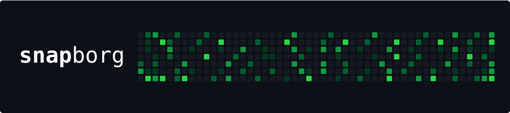

Scrapes snapshot to pin the IPFS files to your own node.


## Quickstart

> you can ignore the Makefile and Dockerfile no reason to use them

0. Install via `npm/yarn`, startup your local IPFS daemon

> Note there is a script `check-ipfs.sh` if you are unsure if your IPFS daemon is working!

1. configure the `run.sh` with your parameters, the default is setup to Yearn Finance's snapshot (ychad.eth)

2. Run the command
```bash
./run.sh
```
3. Examine the directory `data/` 


# How to Run

Copy and rename `.env.example` to `.env` and replace the variables with their
corresponding values.

```sh
cp .env.example .env
```

Scrape Snapshot API and sync files to IPFS

```sh
make scrape
```

# How it works

- `scrape.ts` hits snapshots API to get all the proposals
- It writes the file proposals.txt to use for `ipfs-sync`
- It then gets all the votes from the proposals from snapshots api
- It writes the file votes.txt
- It then runs `ipfs-sync` on these four files
- All the scripts are de-dupped so that this could run on a VM in the cloud,
  ping it once a day, and it will only append to the txt files. Then ipfs-sync
  already skips over dupes.
